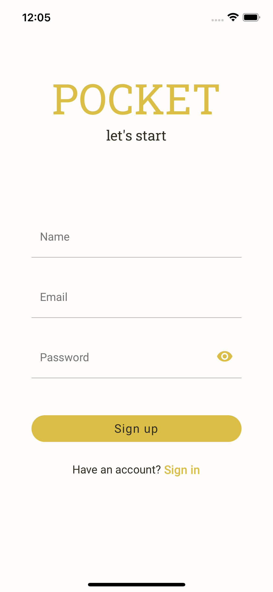
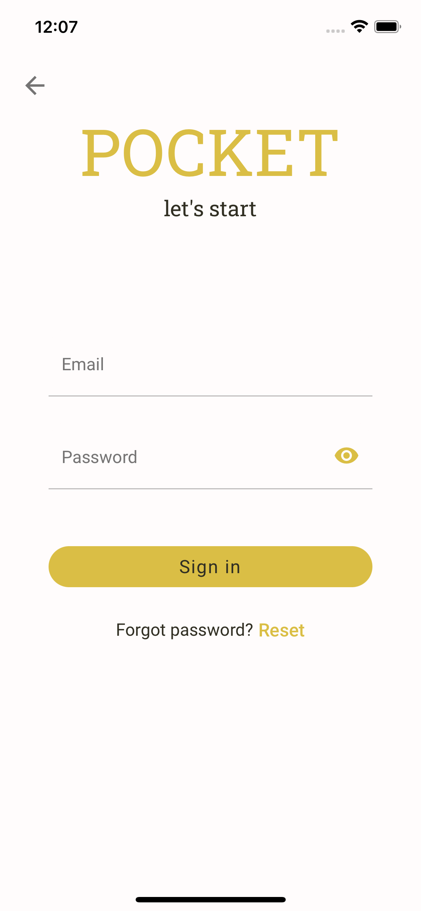
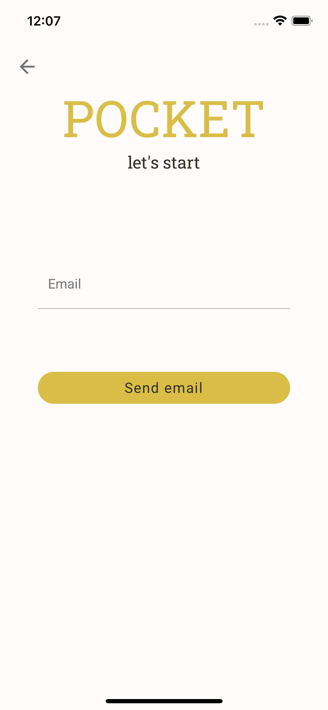

# React Native auth flow

This example is a template for basic authentication flows with according UI in web and native application (ios/android).

## Including:

- Login
- Register
- Forgot password (by email)
- Verify token (by email)

<br />

## Stack

### api

- node.js - node server
- apollo-server-express - as an add-on for GraphQL compatibility
- postgresql - relational database
- mikro-orm - typescript ORM
- type-graphql - typescript GraphQL schemas

### application

- react-native - Android and iOS using React
- react-native-paper - material design for RN
- urql - GraphQL for API calls (inc. tokens managment)
- react-redux - user state managment
- expo-secure-store - secure tokens storage

### web

- next.js - react framework
- urql - GraphQL for API calls
- emotion - css styles composition

<br />

## Setup

#### Environment

- yarn 1.22.15
- node lts/fermium

#### Run from root folder

```bash
yarn --cwd ./packages/app
yarn --cwd ./packages/server
yarn --cwd ./packages/web
```

#### Run from packages/server folder

```bash
 docker-compose up -d
 yarn migration:create
 yarn migration:update
 yarn seed:profile_icon
```

<br />

## Run

#### From packages/server folder - to load server

```bash
yarn dev
yarn watch
```

#### From packages/app folder - to load native application in emulator

```bash
yarn start
yarn <ios/android>
```

#### From packages/web folder - to load web application

```bash
yarn dev
```

<br />

## Examples

<p float="left">
    
    
    
    
</p>
