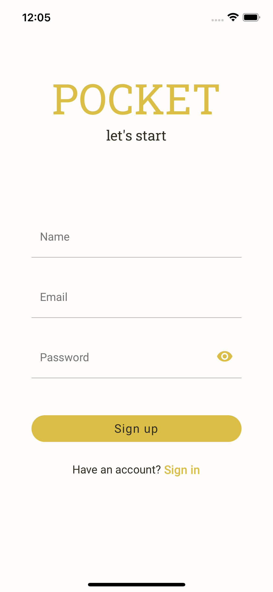
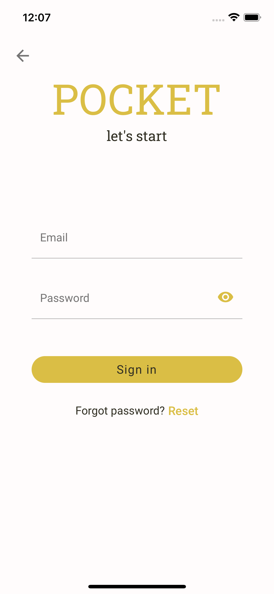
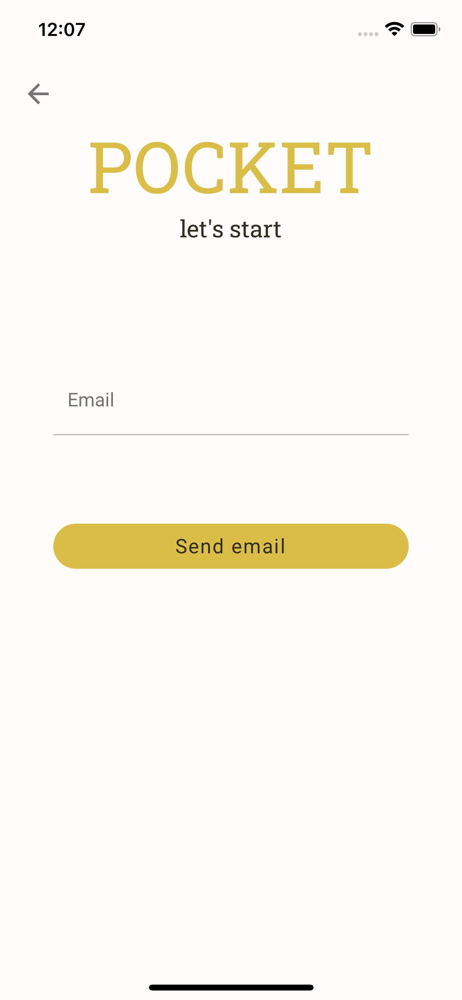
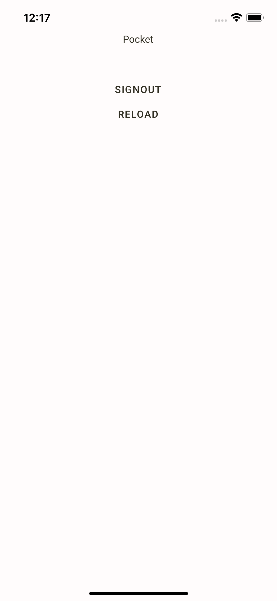

# React Native auth flow

This project was created as part of explore and implement of new javascript libraries/framework that I yet had the opportunity to work with. It is native application of authentication screens with support with restore password and account verification flows, which are partly web and email pages. [OWASP](https://cheatsheetseries.owasp.org/cheatsheets/Authentication_Cheat_Sheet.html) auth security best practices were taken into account but it always can be improved.

<br />

## Screens:

#### with support for form fields and server validation error notifications

- Login
- Register
- Forgot password (by email)
- Verify token (by email)

<br />

<p float="left">
    
    
    
    
</p>
<br />

## Stack

### api

- [node.js](https://nodejs.org/en/) - node server
- [apollo-server-express](https://github.com/apollographql/apollo-server) - as an add-on for GraphQL compatibility
- [mikro-orm](https://mikro-orm.io/) - typescript ORM
- [typegraphql](https://typegraphql.com/) - typescript GraphQL schemas
- [postgresql](https://www.postgresql.org/) - relational database

### application

- [react-native](https://reactnative.dev/) - Android and iOS using React
- [react-redux](https://react-redux.js.org/) - user state managment
- [urql](https://formidable.com/open-source/urql/) - GraphQL API calls (inc. tokens managment)
- [expo-secure-store](https://docs.expo.dev/versions/latest/sdk/securestore/) - secure tokens storage
- [react-hook-form](https://react-hook-form.com/) - forms with validations
- [yup](https://github.com/jquense/yup/) - schema validation
- [react-native-paper](https://callstack.github.io/react-native-paper/) - material design for RN

### web

- [next.js](https://nextjs.org/) - react framework
- [urql](https://formidable.com/open-source/urql/) - GraphQL API calls
- [emotion](https://github.com/emotion-js/emotion/tree/main/packages/react) - css styles composition

<br />

## Setup

#### Environment

- yarn 1.22.15
- node lts/fermium (for [nvm](https://github.com/nvm-sh/nvm) type in terminal at project\`s root folder: `"nvm use"`)

#### Run from root folder

```bash
yarn --cwd ./packages/app
yarn --cwd ./packages/server
yarn --cwd ./packages/web
```

#### Run from packages/server folder

```bash
 docker-compose up -d
 yarn migration:create
 yarn migration:update
 yarn seed:profile_icon
```

#### [Ethereal](https://ethereal.email/) SMTP service

navigate to `./packages/server/src/managers/email.manager.ts` to setup account credentials

<br />

## Run

#### From packages/server folder - to load server

```bash
yarn dev
yarn watch
```

#### From packages/app folder - to load native application in emulator

```bash
yarn start
yarn <ios/android>
```

#### From packages/web folder - to load web application

```bash
yarn dev
```

<br />
